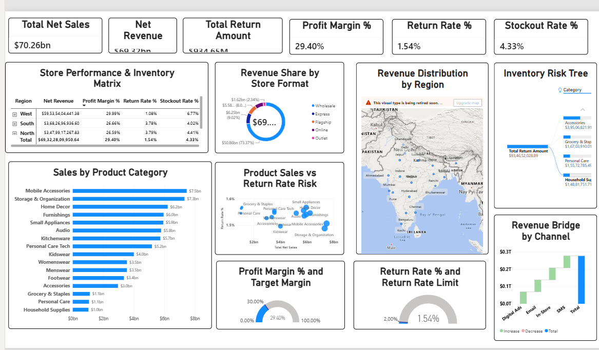

# 📊 Retail Executive Performance & Risk Analytics Dashboard

An executive-grade retail analytics dashboard developed in **Microsoft Power BI** to evaluate multi-channel sales performance, profitability trends, product category contributions, and operational risk metrics across inventory and returns.

---

## 📸 Dashboard Preview



---

## 📌 Executive Summary & Key Insights

* **Financial Health:** Generated **$70.26B** in Total Net Sales and **$69.32B** in Net Revenue, maintaining a healthy **29.40% Profit Margin** against a 30.00% benchmark.
* **Return Risk Control:** Product returns stand at **$934.65M** with a global **Return Rate of 1.54%**, successfully staying below the critical **2.00% operational risk ceiling**.
* **Inventory Availability:** Maintained a **4.33% Stockout Rate**, with actionable drill-downs identifying specific regional bottlenecks.

---

## 🎯 Core Metrics & KPIs

| Metric | Measure Logic | Value / Status | Benchmark / Target |
| :--- | :--- | :--- | :--- |
| **Total Net Sales** | `SUM('fact_sales'[net_sales_amount])` | **$70.26B** | — |
| **Net Revenue** | `[Total Net Sales] - [Total Return Amount]` | **$69.32B** | — |
| **Total Return Amount** | `SUM('fact_returns'[return_amount])` | **$934.65M** | — |
| **Profit Margin %** | `DIVIDE([Total Net Sales] - [Total COGS], [Total Net Sales], 0)` | **29.40%** | Target: **30.00%** |
| **Return Rate %** | `DIVIDE([Total Return Amount], [Total Net Sales], 0)` | **1.54%** | Threshold: **< 2.00%** |
| **Stockout Rate %** | `DIVIDE([Stockout Events], [Total Inventory Checks], 0)` | **4.33%** | Operational Risk |

---

## 🛠️ Data Architecture & Star Schema

The project utilizes an optimized **Star Schema** data model for fast DAX query evaluation and seamless cross-filtering:

              ┌──────────────────────┐
              │       dim_date       │
              └──────────┬───────────┘
                         │
 ┌───────────────────────┼───────────────────────┐
 │                       │                       │
┌────┴───────────────┐ ┌─────┴──────────────┐ ┌─────┴─────────────────┐
│     dim_store      │ │     dim_product    │ │   dim_campaign / cust │
└────┬───────────────┘ └─────┬──────────────┘ └─────┬─────────────────┘
│                       │                      │
├───────────────────────┼──────────────────────┤
│                       │                      │
┌────┴──────────────┐ ┌──────┴──────────────┐ ┌─────┴─────────────────┐
│    fact_sales     │ │    fact_returns     │ │fact_inventory_snapshot│
└───────────────────┘ └─────────────────────┘ └───────────────────────┘


* **Fact Tables:** `fact_sales`, `fact_returns`, `fact_inventory_snapshot`, `fact_staffing`
* **Dimension Tables:** `dim_date`, `dim_product`, `dim_store`, `dim_customer`, `dim_campaign`

---

## 📊 Key Visualizations & Analytics Features

1. **Executive KPI Strip:** Formatted cards displaying top-line financial and risk indicators.
2. **Monthly Revenue vs. Profit Margin Trend:** Dual-axis visual (Clustered Column + Line Chart) mapping seasonal sales fluctuations alongside margin efficiency.
3. **Product Category Breakdown:** Horizontal Clustered Bar Chart tracking high-volume revenue drivers.
4. **Channel & Store Format Dynamics:** Donut Chart displaying revenue split across store formats (Flagship, Express, Mall).
5. **AI Root-Cause Decomposition Tree:** Interactive drill-down visual to trace stockout spikes across regions, store formats, and categories.
6. **Benchmark Target Gauges:**
   * **Profit Margin Gauge:** Real-time tracking against the **30% Target**.
   * **Return Rate Gauge:** Alert-based gauge tracking performance against the **2% Risk Threshold**.
7. **Store Performance Matrix:** Tabular regional risk overview with conditional formatting on stockouts.

---

## 💻 Key DAX Measures Used

```dax
// Profit Margin %
Profit Margin % = 
DIVIDE(
    [Total Net Sales] - SUM('fact_sales'[cost_amount]), 
    [Total Net Sales], 
    0
)

// Return Rate %
Return Rate % = 
DIVIDE(
    [Total Return Amount], 
    [Total Net Sales], 
    0
)

// Target Gauges
Target Margin = 0.30
Return Rate Limit = 0.02
